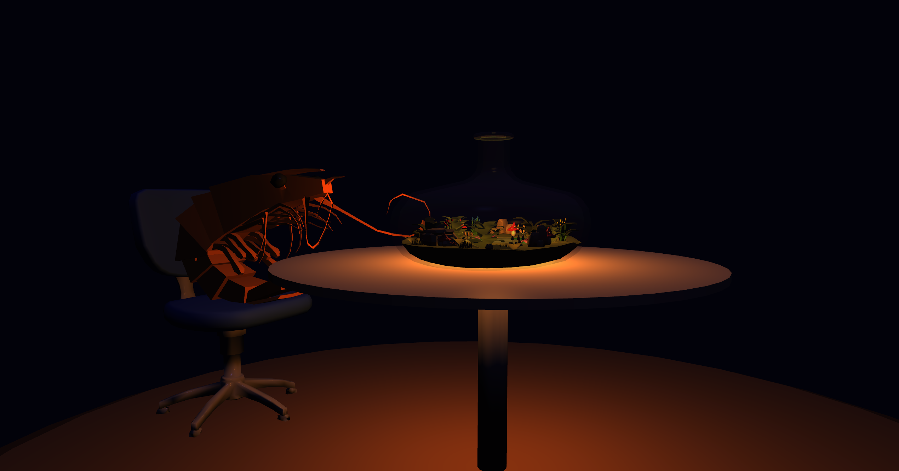
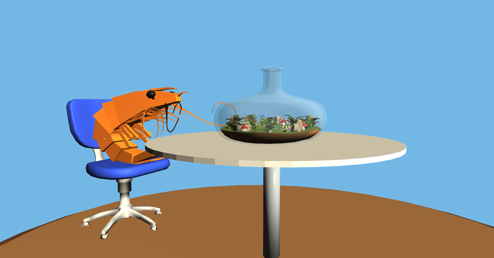
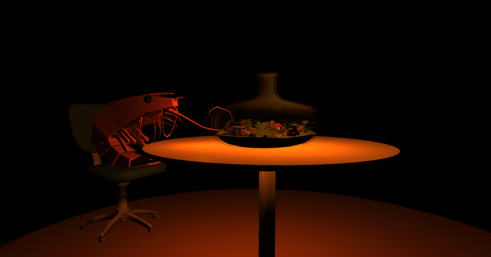

# Computer_Graphics_Final_Project
**Integrantes:**
- Cornejo Castro, José Gabriel
- Hidalgo Machaca, Diego Alejandro
- Huarcaya Lizarraga, Astrid Judith

## Descripción
Implementación de un terrario en una botella, usando OpenGL como base. Implementacion de iluminación, cinemática inversa, etc.

## Imagenes de referencia
| Referencia 1 | Referencia 2 | Referencia 3 |
| :---: | :---: | :---: |
|  |  |  |